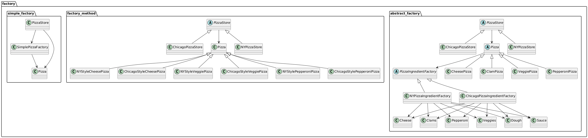

# Carpeta factory - UML y Descripción

## UML de la arquitectura



## Descripción general

La carpeta `factory` contiene tres implementaciones del patrón de creación de objetos para una pizzería: **Simple Factory**, **Factory Method** y **Abstract Factory**. Cada subcarpeta muestra una evolución en la flexibilidad y el desacoplamiento del código

### Estructura

- **simple_factory/**  
  Implementa una fábrica simple para crear pizzas. El cliente (PizzaStore) delega la creación de pizzas a una clase `SimplePizzaFactory`.

- **factory_method/**  
  Usa el patrón Factory Method. Cada sucursal (`NYPizzaStore`, `ChicagoPizzaStore`) implementa su propio método de creación de pizzas, permitiendo variaciones regionales

- **abstract_factory/**  
  Usa el patrón abstract factory. Además de las sucursales, hay fábricas de ingredientes (`NYPizzaIngredientFactory`, `ChicagoPizzaIngredientFactory`) que permiten crear familias de ingredientes consistentes para cada región. Las pizzas se arman usando estas fábricas

### Cómo funciona

1. **Simple Factory:**  
   - `PizzaStore` recibe una instancia de `SimplePizzaFactory`.
   - Cuando se ordena una pizza, la fábrica crea el objeto pizza adecuado según el tipo pedido

2. **Factory Method:**  
   - `PizzaStore` es una clase abstracta con un método `create_pizza`.
   - Cada subclase (`NYPizzaStore`, `ChicagoPizzaStore`) implementa este método para crear pizzas específicas de la región

3. **Abstract Factory:**  
   - Cada `PizzaStore` usa una `PizzaIngredientFactory` para obtener los ingredientes correctos.
   - Las pizzas (`CheesePizza`, `ClamPizza`, etc.) reciben la fábrica de ingredientes y la usan en su método `prepare` para armarse con los ingredientes regionales

### Ejecución

Desde la raíz del proyecto, puedes ejecutar cada versión con:

```bash
python -m factory.simple_factory.main
python -m factory.factory_method.main
python -m factory.abstract_factory.main
```

### Pruebas

Las pruebas unitarias para abstract factory están en `factory/abstract_factory/test_pizzas.py` y pueden ejecutarse con:

```bash
python -m pytest factory/abstract_factory/test_pizzas.py
```
